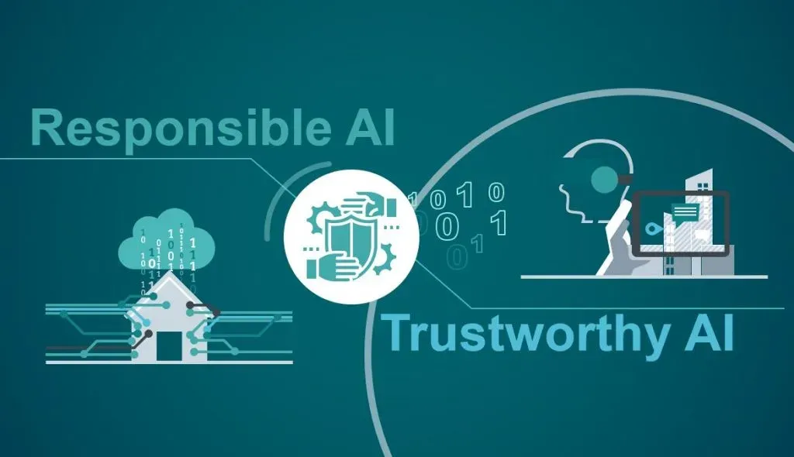
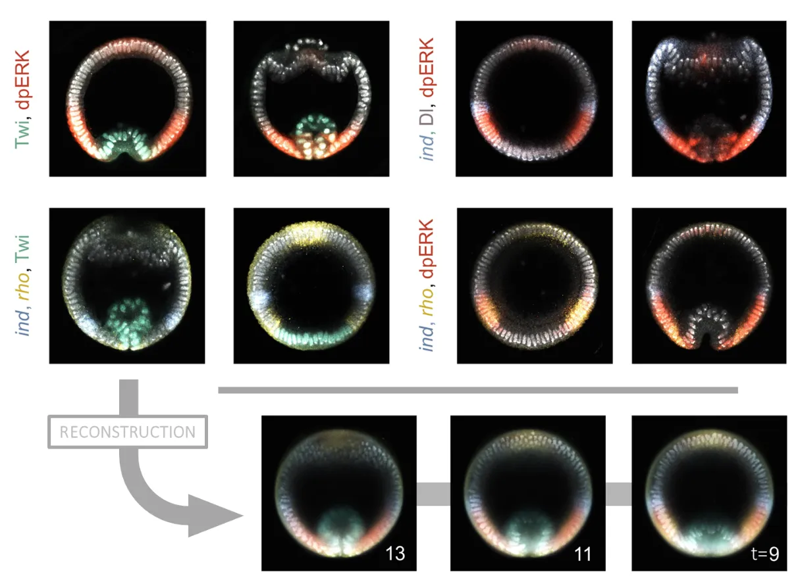



I have wrote multiple articles related to Software Development and Artificial Intelligence. In this page you can find some of them. In case you want to know more about any of them, feel free to ping me via mail or linkedin.

### Navigating the Future: Embracing Responsible AI for an Ethical Tomorrow
{: style="float: left" width="300px" height="300px"}

The [article](https://medium.com/@cyrilmarzook/navigating-the-future-embracing-responsible-ai-for-an-ethical-tomorrow-cf9fddcb8c06) emphasizes the importance of responsible AI development, advocating for a holistic approach that prioritizes ethical considerations, transparency, fairness, and inclusivity. It stresses the need for human-centric AI, where technology enhances human capabilities. The role of education, awareness programs, and governmental regulations is highlighted to ensure ethical standards in AI, aiming for a digital future where technology uplifts humanity responsibly.

### Google Jigsaw : Toxic Comment Classification
In addressing a Kaggle competition by Jigsaw Google, the project aims to build a multi-headed model for detecting online toxicity in comments. The [exploration](https://medium.com/@cyrilmarzook/google-jigsaw-toxic-comment-classification-727e38e988a1) involves diverse classification methods, including GloVe embeddings (50D to 300D), and testing five model architectures: CNN, LSTM, bidirectional LSTM, GRU, and bidirectional GRU. Preprocessing steps encompass comment cleaning, tokenization, and padding. Results consistently favor bidirectional LSTM, showcasing a notable 97.898% accuracy with GloVe 300D. The study concludes that bidirectional LSTM is the most effective model for identifying threats, obscenity, insults, and identity-based hate in online comments, providing valuable insights for addressing complex challenges in online content moderation. Relevant references are included for additional exploration.

### Machine Learning : Multi-omics integration for developmental biology
{: style="float: left" width="300px" height="300px"}
The integration of machine learning (ML) and developmental biology is explored in this article, emphasizing multi-omics integration challenges. This [article](https://medium.com/@cyrilmarzook/machine-learning-multi-omics-integration-for-developmental-biology-e3baeaf1d601) discusses the limitations of current technologies, such as 3D live microscopy and high-throughput sequencing, and proposes ML methods like autoencoders, optimal transport, and CycleGAN for bridging imaging and sequencing data. The application focuses on studying left-right asymmetry in Caenorhabditis elegans embryonic development, using 3D imaging and scRNAseq. Despite imperfections, the article concludes that ML advancements significantly contribute to understanding developmental processes. Relevant references, including Hermann et al. (2000), Nitzan et al. (2019), Villoutreix et al. (2017), and Yang et al. (2021), offer additional insights.

